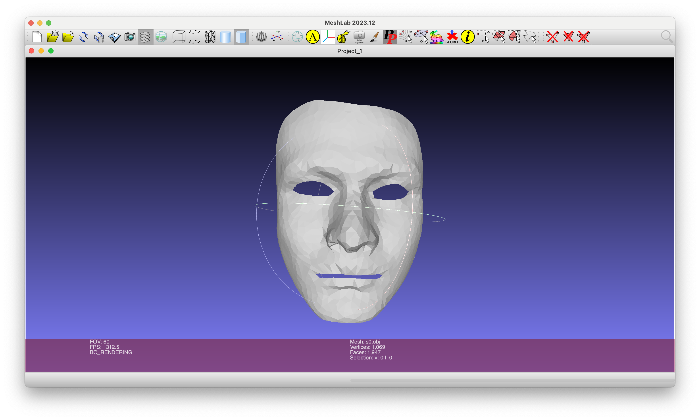
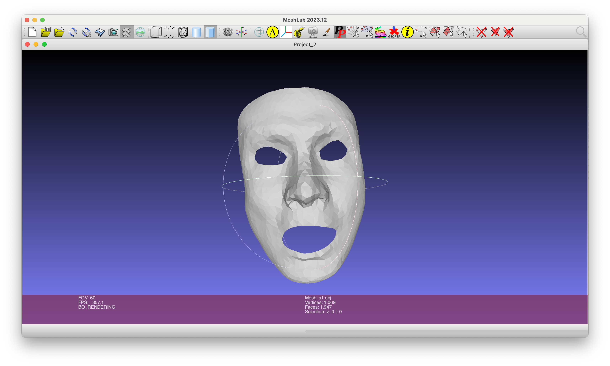
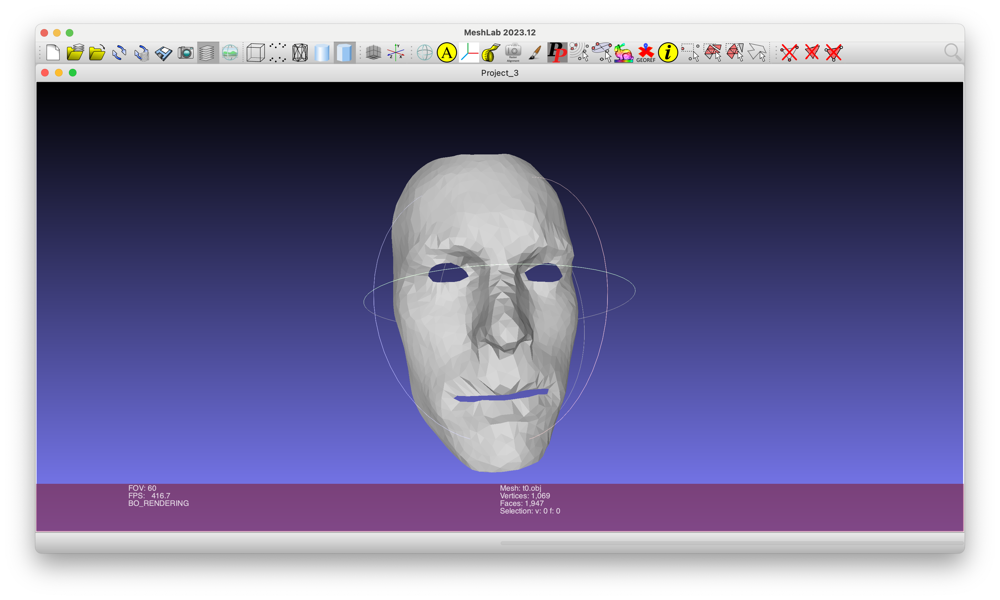
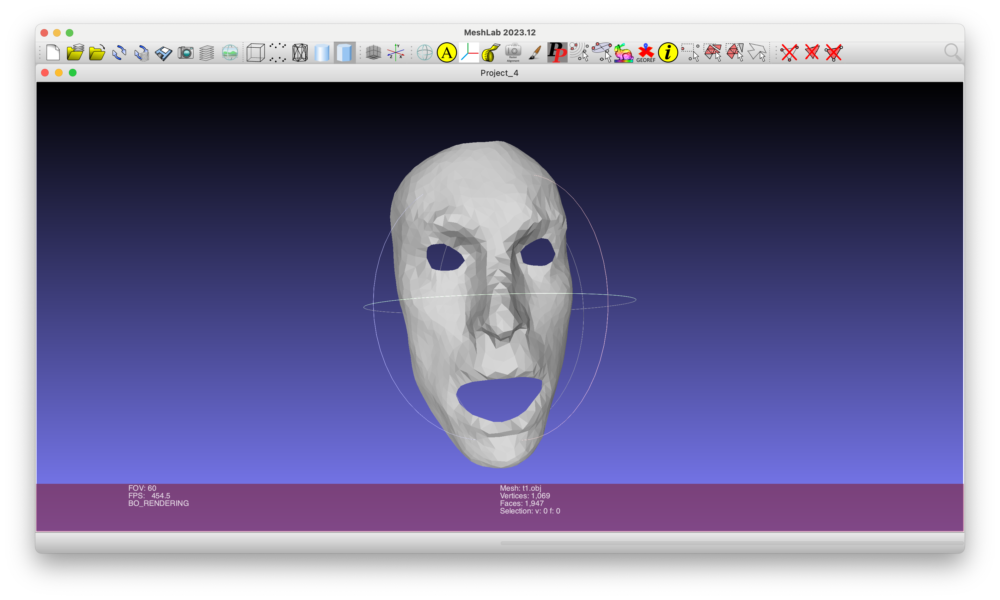

## Reproducing 'Deformation Transfer for Triangle Meshes'
### Introduction
This project is a homework assignment for Computer Graphics (CG).  
Our goal is to transfer the change in shape exhibited by the source deformation onto the target structural consistency.

Input: $s_0$ $t_0$ $s_1$

Output: $t_1$

**We assume that the source and target meshes have the same number of vertices or triangles.**  

### Mathematical Derivation
For detailed mathematical derivations, please refer to [Math.pdf](Math.pdf).

### Example

Input :

s0.obj

s1.obj

t1.obj

Output :

t1.obj

### Reference
[Deformation Transfer for Triangle Meshes](https://people.csail.mit.edu/sumner/research/deftransfer/Sumner2004DTF.pdf)

[Mathematical Derivation](https://blog.scubot.com/article/4581/)